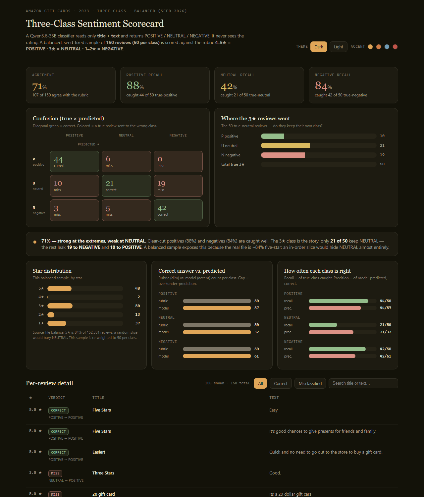


# Amazon Gift Cards — Review-Sentiment Classifier

A three-class (POSITIVE / NEUTRAL / NEGATIVE) sentiment classifier for product reviews, built
for the "Business Generative AI and LLMs" course. A large language model reads each review's
**title and text only** (it never sees the star rating), predicts the sentiment, and every
prediction is scored against the rating-derived ground truth. The results are presented in a
self-contained, interactive dashboard.

**The dashboard** (viewport): the three-class scorecard with KPIs, confusion matrix, descriptive panels, and the interactive review table.



**Full-page capture:**



- **Headline agreement:** 71% (107 of 150) on a balanced three-class sample
- **Per-class recall:** POSITIVE 88% (44/50) · NEUTRAL 42% (21/50) · NEGATIVE 84% (42/50)
- **Live dashboard (3-class):** [`dashboard/dashboard_3class.html`](dashboard/dashboard_3class.html)

---

## The data

The reviews come from the **Amazon Reviews '23** dataset (Gift Cards category), collected by the
**McAuley Lab at UC San Diego**:

- Dataset site: <https://amazon-reviews-2023.github.io>
- Raw Gift Cards file: <https://mcauleylab.ucsd.edu/public_datasets/data/amazon_2023/raw/review_categories/Gift_Cards.jsonl.gz>

`Gift_Cards.jsonl.gz` is a gzipped newline-delimited JSON file (one review per line). This
project uses the fields `rating`, `title`, `text`, `verified_purchase`, `helpful_vote`,
`timestamp`, `images`, `asin`, `parent_asin`, and `user_id`; the classifier itself consumes only
`title` and `text`. The file is 152,410 reviews for this category.

## How the classifier works

1. **Ground-truth rubric** (the rule every prediction is checked against):

   | Star rating | Class |
   |---|---|
   | 4–5 ★ | POSITIVE |
   | 3 ★ | NEUTRAL |
   | 1–2 ★ | NEGATIVE |

2. **Balanced sampling.** The source file is heavily skewed (`5★` is ~84% of all reviews), so we
   do **not** take the first N rows in order. Instead we sample **50 reviews per class** (150
   total) from the whole file with a fixed random seed (`2026`) so the same set regenerates every
   run.

3. **Prediction.** All 150 reviews are sent to an LLM in one numbered prompt (see
   [`prompt/classifier_prompt.txt`](prompt/classifier_prompt.txt)). The model returns a numbered
   list of POSITIVE / NEUTRAL / NEGATIVE labels computed from **title + text only**. The star
   rating is used *only after* the prediction, to score it.

4. **Scoring.** Predictions are compared to the rubric; we report overall agreement, per-class
   recall and precision, and a confusion matrix. See
   [`scripts/classify_reviews.py`](scripts/classify_reviews.py) and the saved run in
   [`runs/`](runs/).

## The primary emotion (independent second model, no LLM call)

Alongside sentiment, each review gets a **primary emotion** from the eight basic Plutchik
emotions (anger, anticipation, disgust, fear, joy, sadness, surprise, trust) two independent
ways — the LLM's read, and a pure **word-list** derivation from the **NRC Emotion Lexicon**
(EmoLex; Mohammad & Turney). The word-list method needs no model calls:

```
python scripts/nrc_emotions.py     # adds per-emotion scores + argmax to runs/nrc_emotions.csv
```

## Results

### The balanced three-class run (the headline numbers)

All numbers below are visible on the dashboard and in `runs/balanced3_predictions.json`.

**Confusion matrix** (true class → predicted class):

| true \ predicted | POSITIVE | NEUTRAL | NEGATIVE | recall |
|---|---|---|---|---|
| **POSITIVE** (4–5★) | **44** | 6 | 0 | 88% (44/50) |
| **NEUTRAL** (3★) | 10 | **21** | 19 | 42% (21/50) |
| **NEGATIVE** (1–2★) | 3 | 5 | **42** | 84% (42/50) |
| precision | 77% (44/57) | 66% (21/32) | 69% (42/61) | |

Overall agreement: **107 / 150 = 71%**; 43 reviews misclassified.

## Findings (with evidence)

### 1. Why the lopsided run looked very accurate — and what balanced sampling changed

An in-order "first 100 rows" run scored **97%** agreement. That number is misleading: because
the file is ~84% five-star, that slice contained **93 POSITIVE reviews and only 7 NEGATIVE** —
see `runs/batch_A_first100.csv` (true-class counts 93/7). A model that basically says
"positive" to everything already agrees with 93 of 100; with only 7 negative reviews present
there was almost nothing to fail on.

Balanced sampling (equal 50 per class) removes that crutch. On the balanced **two-class**
sample (`runs/batch_B_stratified.csv`) agreement fell to 88%. Moving to the balanced
**three-class** rubric — where 3★ gets its own class instead of being forced to "negative" —
agreement fell to **71%** and, crucially, exposed that **NEUTRAL is the weakest class by far**
(42% recall vs 88% / 84% on the extremes). The skewed data had effectively hidden the whole
neutral population.

### 2. Which classes get confused, and in which direction

The confusion matrix above gives the concrete answers:

- **NEUTRAL collapses, mostly downward.** Of 50 true 3★ reviews, only **21** keep their own
  class; **19 are labeled NEGATIVE** and **10 are labeled POSITIVE**. So 3★ reviews are
  (a) under-reported as NEUTRAL (the model emits NEUTRAL only ~32 times vs 50 that are true)
  and (b) when misplaced they are about twice as likely to be called **negative** as positive —
  the leak is downward-dominant.
- **Positive reviews are clean:** only 6 of 50 true positives are mislabeled, all as NEUTRAL;
  none become NEGATIVE.
- **Negative reviews leak only mildly upward:** 5 of 50 become NEUTRAL and 3 become POSITIVE
  (mostly short or ambiguous texts).

Net: the model is confident and correct at the extremes, and the neutral zone is where
uncertainty gets pushed — largely toward **negative**, not positive.

### 3. How the LLM's emotions and the word list's emotions differ — and why

Full comparison on 200 scored reviews: `runs/step5_emotions.csv`.

| | LLM | NRC word list |
|---|---|---|
| **exact agreement on primary emotion** | **32 / 164 = 19.5%** | — |
| most common emotion | joy (122) | **anticipation (110 of 200)** |
| no emotion found | 0 | 36 ("no signal") |
| emotion matches rating-derived sentiment polarity | **93% (186/200)** | 56% (112/200) |

The word list and the LLM name the *same* primary emotion only about **1 in 5** reviews. The
reason is structural:

- **Lexicon bias.** EmoLex tags the words "gift", "card", "good", "money", and "store" as
  **anticipation** — and almost every gift-card review mentions "gift" or "card". So the
  word-list method tips into *anticipation* on ~55% of reviews no matter what the review is
  actually saying, even complaints and 1★ reviews.
- **No negation / no context.** The word list counts words; it cannot read *"did NOT get the
  discount"* or sarcastic *"Love it!! …nothing to show, sorry"*. The LLM resolves meaning and
  intent, which is why its emotion agrees with the rating's positive/negative polarity 93% of
  the time vs 56% for the lexicon.
- **Silence on short reviews.** On sparse filler (*"Great"*, *"Easy"*, *"it's a gift card"*)
  the lexicon finds no emotion words at all (36 reviews → no answer) where the LLM still forms a
  judgment.

**Conclusion:** for this gift-card domain the LLM is the meaningful emotion detector; the word
list is a poor fit because this category's vocabulary collides with "anticipation" and it is
blind to negation, sarcasm, and intent.

### 4. Bugs and issues hit along the way, and the workarounds

- **Endpoint authentication.** The professor's classifier endpoint requires a key; without it
  every call returns `Unauthorized`. The key is read **only from the `DOBOLYI_KEY` environment
  variable** — it is never committed to the repo or any output file.
- **Reasoning-model truncation.** The served model is a *reasoning* model that writes thinking
  tokens first; a too-small `max_tokens` cut it off mid-reasoning and returned empty content.
  Fixed by giving it token headroom and disabling the thinking block (`enable_thinking: false`).
- **"One answer per request" trap.** Sending each review as its own user turn made the model
  answer only once (the last review). Fixed by putting all reviews in **one** numbered message
  and asking for a numbered list back.
- **A real UI bug that only the browser caught.** The Step-4 filter buttons looked fine and a
  Node re-check of the filter *logic* passed — but clicking them in a real browser threw
  `Cannot read properties of null (reading 'setAttribute')`. `ping()` was passing bare ids
  (`fA`) to a `querySelector` that needs the `#` prefix, so the filter never applied. It was
  fixed in both dashboards. **Lesson: verify the live click path in a browser, not just the
  math.**
- **No browser in the sandbox** initially — I had to install headless Chromium (Playwright)
  before I could do a real render check; the current model is also non-multimodal, so visual
  QA was done with pixel-fill and geometry scans plus a delegated vision pass.
- **Chart-layout risk.** Tiny counts (e.g. 4★ = 2 rows) can render as a hairline or collapse. I
  gave every bar a `min-width` floor and keep counts as labels outside the track; a live scan
  confirmed **zero collapsed bars** in the final dashboard.
- **LLM nondeterminism.** Even at temperature 0 the model is not bit-stable across calls; the
  balanced run shifted by one review between two identical runs (43 vs 44 misclassified). The
  deliverable therefore anchors every number to **one canonical saved run.**

## Repository layout

```
.
├── README.md
├── data/
│   ├── Gift_Cards.jsonl.gz                          # source data (auto-downloaded if absent)
│   └── NRC-Emotion-Lexicon-Wordlevel-v0.92.txt      # public EmoLex emotion word list
├── prompt/
│   └── classifier_prompt.txt                        # the exact prompt sent to the LLM
├── scripts/
│   ├── classify_reviews.py                          # sampling + LLM call + scoring (the run)
│   ├── nrc_emotions.py                              # word-list emotion scorer (no model)
│   └── build_dashboard.py                           # regenerates the dashboard HTML
├── runs/
│   ├── balanced3_raw_model_output.txt               # raw model answer for the balanced run
│   ├── balanced3_prompt.txt                         # the exact request for that run
│   ├── balanced3_predictions.json                   # full predictions + scores (one run)
│   ├── step6_three_class.csv                        # same run as CSV
│   ├── nrc_emotions.csv                             # word-list emotions
│   ├── step5_emotions.csv                           # LLM vs NRC emotions (200 reviews)
│   ├── batch_A_first100.csv                         # imbalanced (in-order) run — for Q1
│   └── batch_B_stratified.csv                       # balanced 2-class run — for Q1
├── dashboard/
│   └── dashboard_3class.html                        # final, self-contained dashboard
└── screenshots/
    ├── dashboard_3class_preview_full.png
    └── dashboard_3class_preview_viewport.png
```

## How to run

```bash
# 1. set the endpoint key (provided by the instructor) — never commit it
export DOBOLYI_KEY=your-key

# 2. run the balanced three-class classifier + scoring
python scripts/classify_reviews.py

# 3. add the word-list emotions (no API call)
python scripts/nrc_emotions.py

# 4. regenerate the dashboard from the saved run
python scripts/build_dashboard.py
```

The dashboard (`dashboard/dashboard_3class.html`) is a single portable HTML file — it works
offline, needs no server, and every number on it is recomputed from the review data it embeds,
so it always matches the saved run. Open it in any browser.
